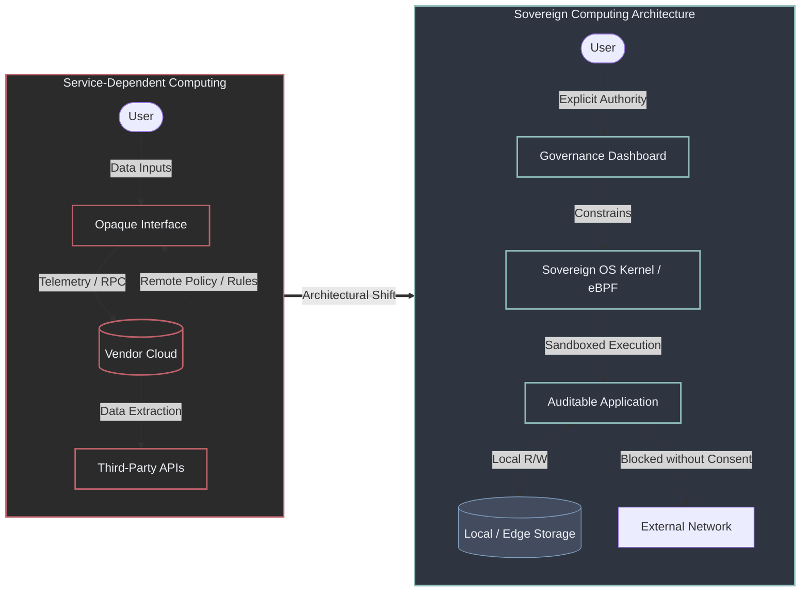
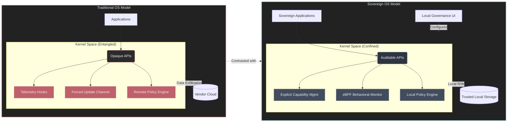

# Digital Sovereignty: A layered architecture for trustworthy informatics

## Abstract

Digital sovereignty is often invoked as a political or legal objective, but rarely specified as an engineering property. This article reframes digital sovereignty as a measurable systems attribute emerging from the interaction of infrastructure, software behavior, governance, and explainable artificial intelligence. It then advances a concrete hypothesis: that performance, privacy, and sovereignty can coexist if operating systems are designed around control surfaces rather than feature accumulation. This work is a conceptual systems framework, not an empirical evaluation.

## 1. Introduction

“Digital sovereignty” has become a ubiquitous term—invoked so frequently that its meaning is increasingly diluted. In many cases, what is presented as sovereignty is little more than managed dependency: opaque platforms, proprietary control planes, and decision systems that cannot be meaningfully inspected. The vocabulary has evolved; the power structures often have not.

From a computer science perspective, this framing is insufficient. Digital sovereignty should not be treated as a slogan, a legal aspiration, or a compliance label, but as a **measurable systems property**. A system is sovereign to the degree that its operator can inspect, constrain, reproduce, and override its behavior without relying on opaque intermediaries.

Sovereignty is not tested under normal conditions, but under contested ones. If a user cannot audit the binary that manages encryption keys, cannot reconstruct why a model has classified a file or recommended an action, or cannot determine under which jurisdiction computation is actually taking place, then sovereignty is conditional rather than real. A system may appear autonomous during routine operation, yet that autonomy can be revoked by a vendor decision, a remote update, or an extraterritorial legal order.

This article introduces the **Sovereignty Stack** as a response to that problem. A truly sovereign architecture is not merely a privacy-oriented desktop environment. It requires formalizing a layered framework in which execution locality, legal exposure, algorithmic behavior, governance authority, and explainability are treated as mutually dependent design constraints (see Figure 1).



*Transition from service-dependent computing to a sovereign architecture with local authority, constrained execution, and explicit network consent.*

## 2. Sovereignty as a Layered Systems Property

Digital systems rarely fail in a single catastrophic event. They degrade asymmetrically. Storage may be encrypted while behavioral telemetry leaks. Applications may execute locally while delegating critical functionality to opaque remote APIs. Interfaces may promise user control while reserving final authority for vendor-managed policy layers.

Modern operating systems have evolved into highly entangled dependency trees in which the user is often positioned at the bottom of the effective privilege hierarchy. When a system administrator is outranked by the telemetry logic of the platform vendor, the architecture is not neutral; it is structurally disloyal.

For this reason, sovereignty must be understood as a **layered systems property**. Each layer protects a different dimension of autonomy, and the guarantees of any one layer remain meaningful only if the others do not silently cancel them. The objective is not ideological purity, but dependency reduction by design.

A system is not sovereign because it behaves correctly under normal conditions, but because its guarantees remain as invariant as possible under stress, interference, or adversarial pressure. In this sense, digital sovereignty is closely related to robustness and resilience, but directed specifically at power asymmetries and control surfaces (see Figure 2).

```mermaid
flowchart BT
    %% Definición de estilos
    classDef secure fill:#2e3440,stroke:#8fbcbb,stroke-width:2px,color:#eceff4
    classDef critical fill:#bf616a,stroke:#eceff4,stroke-width:2px,color:#eceff4
    classDef compromised fill:#2b2b2b,stroke:#bf616a,stroke-width:2px,stroke-dasharray: 5 5,color:#bf616a

    %% Nodos de las Capas (Apilados de abajo hacia arriba)
    L1["Layer 1: Infrastructure (Hardware / Edge Intact)"] ::: secure
    L2["Layer 2: Algorithmic Protection (Breach: Hidden Telemetry Active)"] ::: critical
    L3["Layer 3: Management & Governance (Nominal Control Bypassed)"] ::: compromised
    L4["Layer 4: Trustworthy AI (Epistemic Trust Broken)"] ::: compromised
    L5["Layer 5: Digital Sovereignty (Sovereign State Revoked)"] ::: compromised

    %% Relaciones y cascada de fallos
    L1 -->|Secure Foundation| L2
    L2 -.->|1. Lateral Data Exfiltration| L3
    L3 -.->|2. False Sense of Authority| L4
    L4 -.->|3. Systemic Cascading Failure| L5

    %% Anotación lateral
    note1["Asymmetric Degradation: A low-level behavioral breach silently invalidates high-level user guarantees."]
    L2 --- note1
    
    style note1 fill:#434c5e,stroke:#d08770,stroke-width:1px,color:#eceff4
```

*Asymmetric degradation across layers: compromise at algorithmic protection propagates upward and revokes practical sovereignty.*

## 3. The Sovereignty Stack

This section outlines the five layers through which digital sovereignty can be engineered as an emergent property rather than a marketing label.

### 3.1 Execution & Infrastructure — The “Where”

All computation happens somewhere—on hardware owned by someone, governed by someone, and subject to one or more jurisdictions. Cloud abstractions obscure this fact behind convenience, but abstraction does not dissolve legal or political authority.

Legal analysis of the [U.S. CLOUD Act](https://www.eurojust.europa.eu/publication/cloud-act) shows that U.S.-based service providers can be compelled to disclose data under their control regardless of where that data is physically stored. This demonstrates that geographic location alone does not solve the problem of effective authority.

Infrastructure is therefore not merely a scalability concern; it is a governance boundary. If computation depends on opaque services under foreign legal control, privacy becomes a concession rather than a property. Reclaiming this baseline also means confronting the silicon trust boundary: a sovereign operating system must anticipate a future of auditable firmware (projects such as [coreboot](https://www.coreboot.org/) demonstrate this is already achievable) and open hardware architectures such as [RISC-V](https://riscv.org/), so that proprietary microcode cannot silently bypass operating-system constraints.

A sovereign approach prioritizes:

- Edge-first execution, so processing happens as close as possible to the user and the data source.
- [Local-first storage](https://www.inkandswitch.com/essay/local-first/), ensuring that data remains available without continuous cloud mediation.
- Optional, explicit, and replaceable remote synchronization.
- Substitutable infrastructure, preventing irreversible dependency formation.

Research on [data sovereignty at the edge of the network](https://publications.ait.ac.at/ws/portalfiles/portal/38393888/ICFEC2023-edge-sovereignty.pdf) has shown how relocating computation closer to the data source can reduce dependency, latency, and jurisdictional exposure. This aligns with European policy discussions, including [GDPR](https://gdpr-info.eu/) data residency requirements and initiatives linking [edge computing](https://digital-strategy.ec.europa.eu/en/policies/iot-investing) to privacy, resilience, and technological sovereignty.

### 3.2 Algorithmic Protection — The “How”

Control over hardware and location is insufficient if software behavior itself cannot be observed, predicted, or constrained. Contemporary systems frequently embed telemetry, background analytics, opaque auto-updates, silent network calls, and outsourced decision logic. These mechanisms are often framed as usability or security features, yet they also create channels of influence and extraction.

Algorithmic protection spans two dimensions:

- Cryptographic protection, which preserves confidentiality and integrity.
- Behavioral protection, which ensures that software remains subordinate to explicit user intent.

A system may be strongly encrypted and still be architecturally disloyal if it silently reports metadata, delegates authority to remote services, or executes logic that the operator cannot inspect. Sovereignty therefore requires not only perimeter defense, but algorithmic containment. [Linux namespaces](https://man7.org/linux/man-pages/man7/namespaces.7.html), [sandboxing](https://man7.org/linux/man-pages/man2/seccomp.2.html), [eBPF](https://ebpf.io/what-is-ebpf/)‑based observation, and strict network mediation are relevant not as optional hardening features, but as mechanisms for limiting non-consensual behavior.

A sovereign operating system combines:

- Strong, auditable cryptographic primitives.
- Zero or minimal telemetry by default.
- Auditable package origins and [reproducible builds](https://reproducible-builds.org/).
- Predictable networking behavior with explicit authorization.
- Clear visibility into what software is doing and why.

The goal is not privacy as a checkbox, but **software subordination**: code as an instrument of the operator, not an autonomous agent aligned with remote incentives.

### 3.3 Management & Governance — The “Who”

Sovereignty is ultimately a question of authority: who governs the system when interests diverge?

Nominal administrative privileges are insufficient if they can be overridden by vendor-controlled repositories, forced update channels, mandatory online identities, revocable licenses, or policy engines external to the machine. In such cases, ownership becomes procedural rather than substantive.

Many mainstream platforms externalize governance into legal agreements and remote infrastructure. This may be efficient for platform operators, but it is structurally weak from the standpoint of user autonomy. True governance requires **legibility**: if a user cannot visualize the data flows, permission surfaces, and policy mechanisms of their own machine, they cannot meaningfully govern it.

A sovereign architecture asserts a stricter principle: the user must remain the sole effective root authority over the local system.

This implies:

- No hidden administrative domains.
- No mandatory online account for core local functionality.
- No forced updates.
- No remote revocation of legitimate system capabilities.
- Policies that are local, explicit, inspectable, and revocable.

Governance must be implemented as code that can be read, modified, and overridden—not as remote policy enforced elsewhere (see Figure 3).

```mermaid
flowchart TB
    %% Definición de estilos
    classDef dashboard fill:#2e3440,stroke:#88c0d0,stroke-width:2px,color:#eceff4
    classDef module fill:#3b4252,stroke:#81a1c1,stroke-width:1px,color:#eceff4
    classDef safe fill:#2b3328,stroke:#a3be8c,stroke-width:1px,color:#eceff4
    classDef alert fill:#3b2226,stroke:#bf616a,stroke-width:1px,color:#eceff4

    User([User / Root Authority]) ==>|Inspects & Commands| Dash

    subgraph Dash ["Sovereignty Dashboard (Legible Control Plane)"]
        direction LR
        
        subgraph Auth ["1. Authority Surfaces"]
            direction TB
            P1[Local Policy Engine] ::: module
            P2[Capability Revocation] ::: module
        end

        subgraph Proc ["2. Active Process Monitor"]
            direction TB
            M1[Local AI Inference: Sandboxed] ::: safe
            M2[System Services: Confined] ::: safe
        end

        subgraph Net ["3. Network Isolation Boundaries"]
            direction TB
            N1[Sync to Personal Server: Allowed] ::: safe
            N2[Vendor Analytics: Blocked] ::: alert
        end
        
        Auth -->|Enforces Execution Limits| Proc
        Auth -->|Manages eBPF Firewalls| Net
    end
    
    class Auth,Proc,Net dashboard
    style Dash fill:#222,stroke:#88c0d0,stroke-width:2px,color:#eceff4
```

*Governance dashboard model that keeps authority surfaces, process confinement, and network boundaries legible to the local operator.*

### 3.4 Trustworthy Informatics & AI — The Paradigm Shift

Artificial intelligence introduces a deeper challenge. In earlier systems, opacity concerned code or infrastructure. In AI systems, opacity concerns reasoning itself. Users increasingly receive classifications, recommendations, rankings, and decisions generated by models whose internal logic they cannot meaningfully interrogate.

This creates **epistemic dependence**: the user no longer evaluates outcomes, but defers to them. When a local health model or a security heuristic makes a decision without intelligible justification, the basis for informed consent is weakened. The user is no longer governing the system; the user is trusting an oracle.

Work on trustworthy AI by institutions such as [NIST](https://airc.nist.gov/airmf-resources/airmf/3-sec-characteristics/) and the [EU High-Level Expert Group on AI](https://digital-strategy.ec.europa.eu/en/library/ethics-guidelines-trustworthy-ai) frames trustworthiness not only in terms of performance, but also through accountability, transparency, robustness, explainability, and bias management. Complementary guidance on Explainable AI (XAI), such as [NISTIR 8312](https://nvlpubs.nist.gov/nistpubs/ir/2021/nist.ir.8312.pdf), argues that explanations should be available, meaningful to the intended audience, faithful to actual behavior, and properly delimited by operating conditions. The [EU AI Act](https://artificialintelligenceact.eu/) operationalizes similar requirements as binding obligations for high-risk AI systems, mandating transparency, human oversight, and technical documentation.

Absent these properties, users lose the capacity to contest, correct, or govern algorithmic judgment. Authority migrates from operator to model.

A sovereign system treats explainability as a core requirement, favoring:

- Local inference where feasible.
- Interpretable model classes when task-appropriate.
- Documented inference pipelines.
- Human-readable rationales and logs.
- Explicit declarations of scope, confidence, and failure conditions.

AI must be domesticated—embedded as a constrained component rather than introduced as an unchallengeable oracle.

### 3.5 Digital Sovereignty — The Emergent State

Digital sovereignty is not a feature, a product property, or a compliance label. It is the emergent condition that appears when the previous layers remain coherently aligned.

It marks the transition from a passive model of consent—where users accept terms they cannot negotiate—to an active model of autonomy, where the environment itself structurally resists extraction.

A system approaches sovereignty when:

- Computation is physically and jurisdictionally aligned with the user.
- Software behavior is observable, bounded, and accountable.
- Governance authority resides locally.
- Automated reasoning remains intelligible, auditable, and contestable.

Sovereignty rejects hidden dependence, especially the kind that reveals itself only when control is contested. In that sense, it is best understood as asymmetry reduction.

## 4. Sovereign Computing as a Systems Hypothesis

This framework represents a technical hypothesis: that performance, privacy, and sovereignty can coexist if systems are designed from the beginning around **control surfaces rather than feature accumulation**.

Rather than treating privacy as optional and governance as a legal afterthought, a sovereign architecture begins by defining what must remain under user control—and builds upward from that constraint. This approach is consistent with [local-first software](https://www.inkandswitch.com/essay/local-first/) and related design principles that treat synchronization as a complement to local control rather than its replacement (see Figure 4).



*Contrast between traditional and sovereign OS models, replacing telemetry hooks and remote policy control with auditable local mechanisms.*

## 5. Engineering Directions

The practical application of this architecture requires documenting trade-offs, design decisions, and implementation constraints as they are tested in real-world scenarios.

Current engineering and research directions to achieve this stack include:

- Kernel-level and scheduler optimizations for responsive local workloads.
- Secure-by-default storage and memory configurations.
- Low-telemetry or telemetry-free desktop environments.
- Package trust and reproducibility strategies.
- Local-first synchronization and conflict resolution models.
- Explainable, on-device AI integration.
- Governance-aware UX, where authority and policy remain legible.

The central claim is simple: **sovereignty must be engineered, not declared**.

## 6. A Working Definition

> **Digital sovereignty is the capacity of a user or community to compute, decide, store, and interact digitally under rules they can inspect, enforce, and modify—without hidden dependence on opaque infrastructures, unaccountable software, or non-explainable automated authority.**

## 7. Conclusion

Digital sovereignty is neither nostalgia nor isolationism. It is the effort to recover technical agency in an ecosystem optimized for abstraction, convenience, and dependence.

No single release will “deliver” sovereignty. It must be assembled incrementally, layer by layer, because sovereignty—like security—is not a static state, but a continuous act of system design.

Sovereignty is not granted.  
It is not certified.  
It is engineered—or it does not exist.

---

## How to Cite

**APA**

> Vicente García-Díaz (2026, April 25). *Digital sovereignty: A layered architecture for trustworthy informatics*. FreeOS.me Blog. https://freeos.me/blog/divulgation/digital-sovereignty-architecture/

**BibTeX**

```bibtex
@misc{garciadiaz2026sovereignty,
  author       = {Vicente García-Díaz},
  title        = {Digital Sovereignty: A Layered Architecture for Trustworthy Informatics},
  year         = {2026},
  month        = {April},
  howpublished = {FreeOS.me Blog},
  url          = {https://freeos.me/blog/divulgation/digital-sovereignty-architecture/},
  note         = {Accessed: \today}
}
```